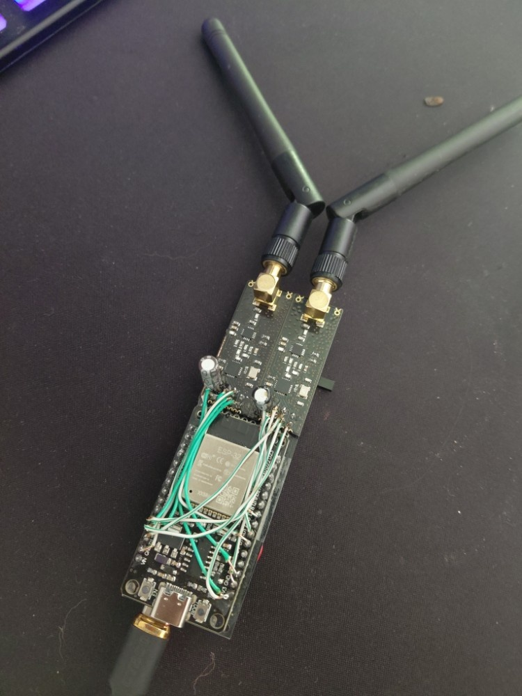
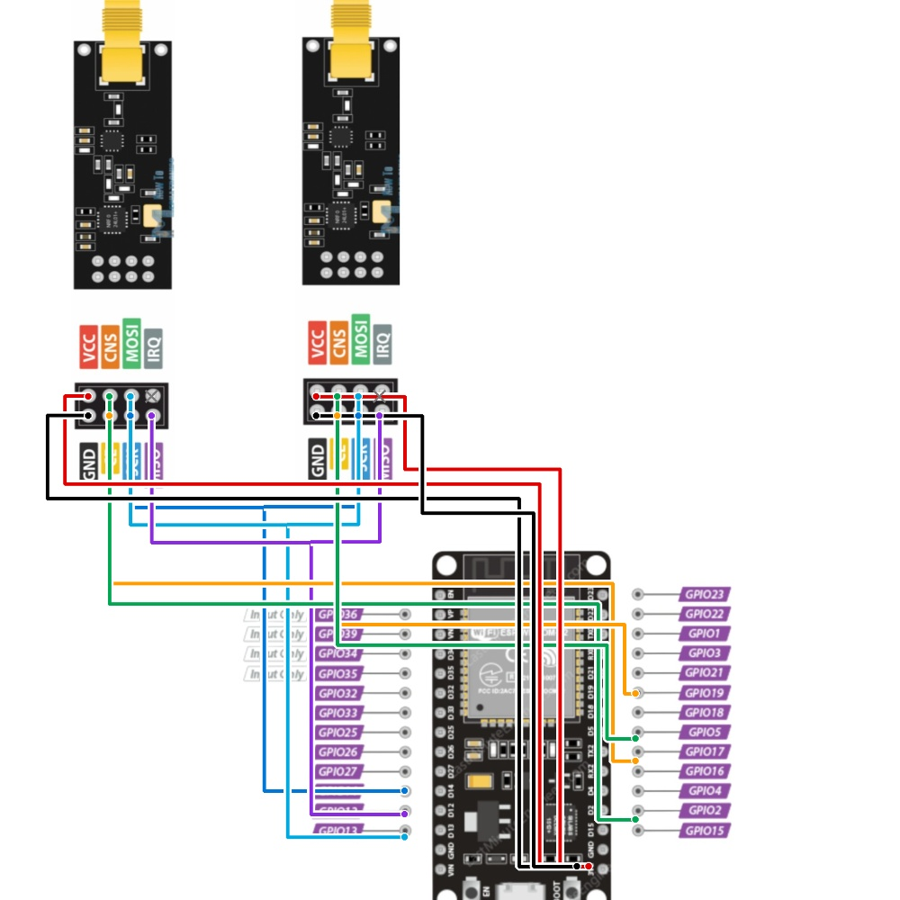

# 24JAMMER

24 Jammer — это простая и эффективная прошивка для тестирования частоты 2.4 ГГц с помощью ESP32 и двух модулей nRF24L01+. Проект выжимает максимум мощности за счет встречного сканирования 50/50: чипы делят спектр пополам, работают синхронно и не мешают друг другу. Есть пресеты под Wi-Fi, Bluetooth и RC, переключение встроенной кнопкой BOOT.

# 24 Jammer (RF Environment Stress-Testing System)


**24 Jammer** — двухканальный программно-аппаратный комплекс на базе микроконтроллера ESP32 и пары радиомодулей nRF24L01+.

Прошивка физически выжимает максимум из доступного кремния благодаря алгоритму разделения спектра между двумя модулями.

---

### Галерея проекта

| Внешний вид устройства | Схема подключения элементов |
| :---: | :---: |
|  |  |

---

### 📋 Список необходимых компонентов

Полный список компонентов и схема подключения находятся в файле **[COMPONENTS.md](COMPONENTS.md)**

#### Основное
- **ESP32** — микроконтроллер (любой вариант, минимум 4 MB Flash)
- **2x nRF24L01+** — радиомодули 2.4 ГГц (рекомендуются Ebyte E01-ML01DP5 с PA/LNA)
- **Источник питания** — 5V, минимум 0.5-1A

#### Дополнительно
- **2x конденсатор 100μF** — развязка для каждого радиомодуля
- **Конденсаторы 0.1μF** — керамические для развязки

> ⚠️ **Встроенные компоненты ESP32:**
> - Синий светодиод на GPIO 2 (индикация статуса)
> - Кнопка BOOT на GPIO 0 (переключение режимов)

---

### 🔧 Поддерживаемое железо (Hardware)

Прошивка полностью оптимизирована под работу со специализированными модулями **Ebyte E01-ML01DP5** (выполненными на базе nRF24L01+ с встроенными PA/LNA усилителями).

Совместимые модули:
- **Ebyte E01-ML01DP5** (рекомендуется) — 500 мВт (+27 dBm) с PA/LNA
- **nRF24L01+ с выносной SMA-антенной** — 100 мВт (+20 dBm)
- **Стандартные nRF24L01+** (антенна на плате) — 1 мВт (0 dBm)

---

### ⚙️ Как это работает (Техническая часть)

В отличие от стандартных генераторов шума, которые скачут по случайным частотам, этот проект разделяет работу двух радиомодулей на две половины спектра 2.4 ГГц:

* **Модуль 1 (Нижний диапазон):** Непрерывно перебирает каналы от 2 до 42.
* **Модуль 2 (Верхний диапазон):** Синхронно движется навстречу первому по каналам от 82 до 42.

Такое разделение полосы полностью решает проблему взаимного экранирования и наводок плат друг на друга при работе на полной мощности.

Управление частотой идет на низком уровне через прямую запись в регистры SPI. После каждого шага прошивка переключает оба модуля синхронно за микросекунды.

---

### 🔌 Распиновка (Pinout)

Для сборки используется общая аппаратная шина **HSPI** микроконтроллера ESP32. Линии данных (`SCK`, `MISO`, `MOSI`) запараллелены между обоими модулями, а управляющие линии (`CE`, `CSN`) разведены отдельно на каждый чип.

| Сигнал nRF24 | ESP32 GPIO (Модуль 1) | ESP32 GPIO (Модуль 2) | Описание линии |
| :--- | :--- | :--- | :--- |
| **VCC (3.3V)** | 3.3V | 3.3V | Питание (через стабилизатор) |
| **GND** | GND | GND | Общая земля устройства |
| **CE** | GPIO 16 | GPIO 18 | Включение передатчика чипа |
| **CSN** | GPIO 15 | GPIO 17 | Выбор устройства по SPI |
| **SCK** | GPIO 14 | GPIO 14 | Тактовая частота шины SPI |
| **MOSI** | GPIO 13 | GPIO 13 | Выход данных master-шины |
| **MISO** | GPIO 12 | GPIO 12 | Вход данных master-шины |

* **Встроенная кнопка BOOT:** GPIO 0 (замыкание на GND) — переключение режимов
* **Встроенный светодиод:** GPIO 2 — индикация статуса

> ⚡ **Важное примечание по питанию:** Система получает питание 5V (минимум 0.5-1A). Напряжение 3.3V для радиомодулей генерируется встроенным регулятором ESP32 и должно быть стабилизировано конденсаторами 100μF на входе и выходе. При использовании модулей Ebyte E01 (500 мВт) может потребоваться внешний стабилизатор 3.3V с отдельным питанием.

---

### 🎮 Режимы и LED-индикация

Смена алгоритмов тестирования происходит на лету кнопкой BOOT по кругу. Встроенный синий диод ESP32 показывает активный режим паттерном мигания.

1. `Режим 0` — **FULL 50/50**: Тотальное встречное сканирование всей полосы. Диод горит постоянно.
2. `Режим 1` — **Bluetooth Classic**: Подавление беспроводного аудио и передачи данных в стандартном Bluetooth-спектре. Медленное мигание (400ms).
3. `Режим 2` — **BLE Focus**: Направленная работа по рекламным каналам Bluetooth Low Energy. Быстрое мигание (80ms).
4. `Режим 3` — **Wi-Fi 1-13**: Точечный проход по частотным центрам каналов роутеров (1–13). Двойная вспышка.
5. `Режим 4` — **RC Random**: Хаотичный разброс частот без пересечения модулей против протоколов управления радиоуправляемыми устройствами. Тройная вспышка.

---

### 📦 Установка и программирование

#### Требования
- Arduino IDE 1.8.19+ или PlatformIO
- Плата ESP32 (установленная в Arduino IDE или PlatformIO)
- Библиотека RF24 (TMRh20)

#### Шаги установки

**Arduino IDE:**
1. Установить ESP32 board: `https://raw.githubusercontent.com/espressif/arduino-esp32/gh-pages/package_esp32_index.json`
2. Sketch → Include Library → Manage Libraries → найти и установить `RF24` (автор TMRh20)
3. Открыть `firmware/24JAMMER.ino`
4. Board: `ESP32 Dev Module`
5. Upload

**PlatformIO:**
1. Создать проект для ESP32
2. Скопировать `24JAMMER.ino` в папку `src/`
3. Добавить в `platformio.ini`:
```ini
lib_deps = 
    https://github.com/nRF24/RF24.git
```
4. Upload

---

### ⚠️ Правовое предупреждение

Использование устройств для передачи радиомех может быть запрещено местным законодательством. Проект предназначен исключительно для образовательных целей и контролируемых экспериментов. Пользователь несет ответственность за соблюдение применимого законодательства.

---

### 📄 Лицензия

GPL 3.0 — см. файл LICENSE

---

### 💡 Кредиты

- Библиотека RF24 от [TMRh20](https://github.com/nRF24/RF24)
- Проект основан на исследованиях спектра 2.4 ГГц
